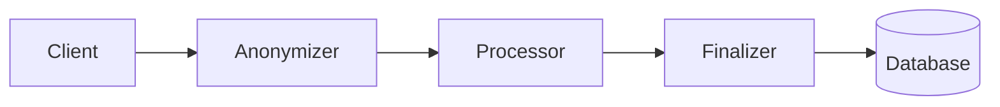

# User Anonymization System

This system provides a robust, daisy-chained approach to user data anonymization using Supabase Edge Functions and Deno.

## Architecture

The system consists of three separate edge functions that form a daisy chain:

1. **Anonymizer** - First function that receives the original request, extracts user data, and anonymizes it
2. **Processor** - Middle function that processes the anonymized data without access to original user information
3. **Finalizer** - Final function that stores the processed anonymized data



## Security Benefits

This daisy-chain approach provides several security benefits:

1. **Separation of Concerns**: Each function has a specific role and limited access to data
2. **Data Isolation**: Original user data never reaches the storage layer
3. **Reduced Attack Surface**: Compromising a single function doesn't expose the entire system
4. **Audit Trail**: Each step in the chain can be independently logged and audited

## Deployment

Use the provided deployment script to deploy all three functions:

```bash
bash scripts/gemini-tumbler/deploy-anonymizer-chain.sh
```

After deployment, configure the function secrets as instructed by the script.

## Configuration

### Anonymizer Function

| Environment Variable | Description | Default |
|----------------------|-------------|---------|
| `ANONYMIZER_ENABLED` | Enable/disable anonymization | `true` |
| `ANONYMIZER_SALT` | Salt used for hashing | (required) |
| `ANONYMIZER_FIELDS` | JSON of fields to anonymize | `{"userId":true,"ipAddress":true,"geolocation":true,"userAgent":true}` |
| `NEXT_FUNCTION_ENDPOINT` | URL of the processor function | (required) |
| `SUPABASE_URL` | Supabase project URL | (required) |
| `SUPABASE_ANON_KEY` | Supabase anonymous key | (required) |

### Processor Function

| Environment Variable | Description | Default |
|----------------------|-------------|---------|
| `NEXT_FUNCTION_ENDPOINT` | URL of the finalizer function | (required) |
| `ENABLE_LOGGING` | Enable debug logging | `false` |

### Finalizer Function

| Environment Variable | Description | Default |
|----------------------|-------------|---------|
| `STORAGE_TABLE` | Table name for storing anonymized data | `anonymized_data` |
| `ENABLE_LOGGING` | Enable debug logging | `false` |
| `ENABLE_STORAGE` | Enable database storage | `true` |
| `SUPABASE_URL` | Supabase project URL | (required) |
| `SUPABASE_SERVICE_ROLE_KEY` | Supabase service role key | (required) |

## Database Setup

Create a table to store the anonymized data:

```sql
CREATE TABLE anonymized_data (
  id UUID PRIMARY KEY DEFAULT uuid_generate_v4(),
  data JSONB NOT NULL,
  created_at TIMESTAMP WITH TIME ZONE DEFAULT NOW()
);

-- Create index for faster queries
CREATE INDEX idx_anonymized_data_created_at ON anonymized_data(created_at);
```

## Usage

### Making Requests

To use the anonymizer system, send your requests to the anonymizer function endpoint with an authorization token:

```javascript
const response = await fetch('https://your-project.supabase.co/functions/v1/anonymizer', {
  method: 'POST',
  headers: {
    'Content-Type': 'application/json',
    'Authorization': `Bearer ${userToken}`
  },
  body: JSON.stringify({
    // Your request data here
    message: "This is a test message",
    action: "process"
  })
});

const result = await response.json();
console.log(result);
```

### What Gets Anonymized

By default, the following user data is anonymized:

1. **User ID** - The authenticated user's ID from Supabase Auth
2. **IP Address** - The client's IP address from request headers
3. **Geolocation** - Any geolocation data from Cloudflare headers
4. **User Agent** - The client's browser/device information

### Customizing Anonymization

You can customize which fields are anonymized by setting the `ANONYMIZER_FIELDS` environment variable:

```bash
supabase secrets set ANONYMIZER_FIELDS='{"userId":true,"ipAddress":true,"geolocation":false,"userAgent":false}' --env anonymizer
```

## Security Considerations

1. **Salt Management**: Store your anonymization salt securely and rotate it periodically
2. **Function Access**: Restrict access to your functions using Supabase RLS policies
3. **Logging**: Be careful not to log sensitive information in any of the functions
4. **Key Rotation**: Regularly rotate your Supabase keys

## Troubleshooting

If you encounter issues:

1. Check the function logs: `supabase functions logs`
2. Verify all environment variables are set correctly
3. Ensure the database table exists and is accessible
4. Check that the function URLs in the chain are correct

## Limitations

1. The system requires authentication to identify users
2. Anonymization is one-way and cannot be reversed
3. The system adds some latency due to the multi-step process