# OpenAI Agent MCP Architecture

## System Overview

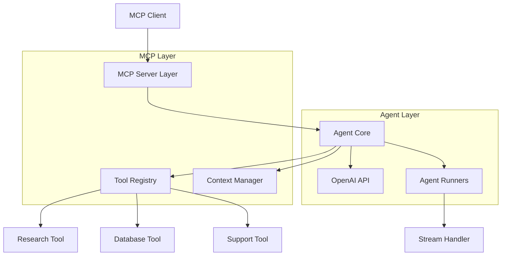

## Component Architecture

### 1. MCP Layer

#### Server Component
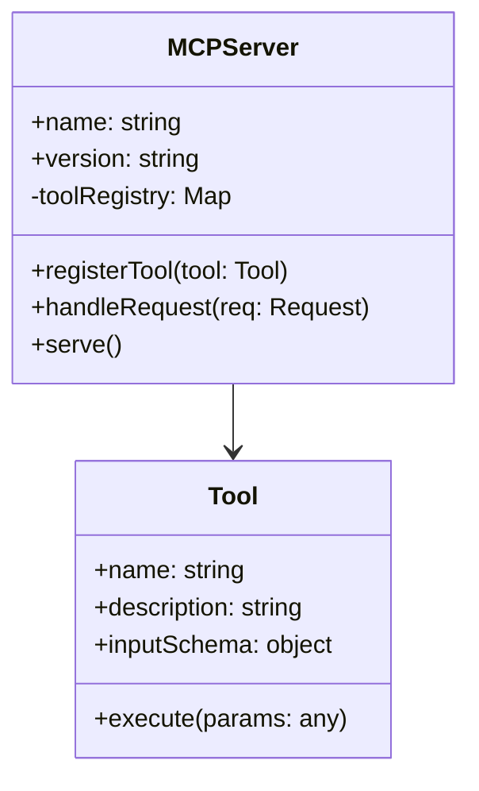

#### Context Management
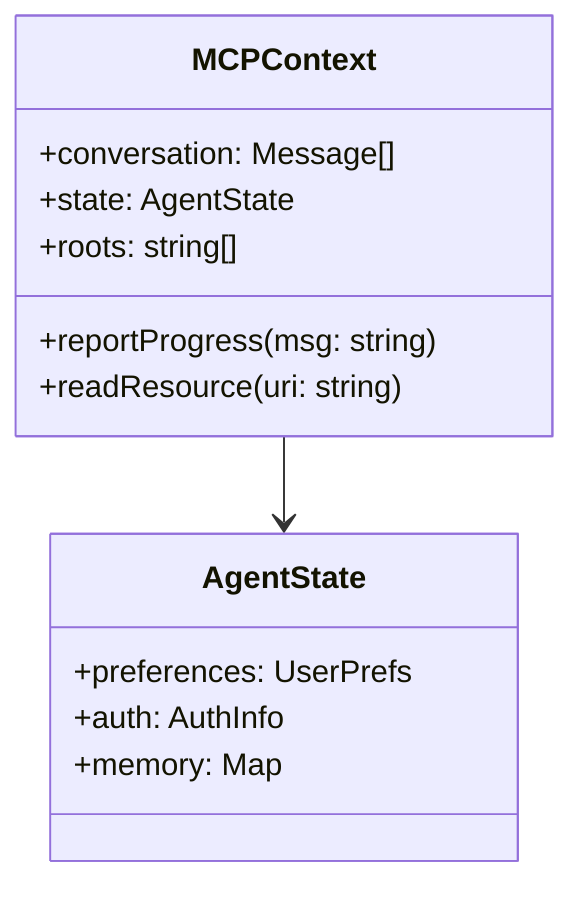

### 2. Agent Layer

#### Agent Runner
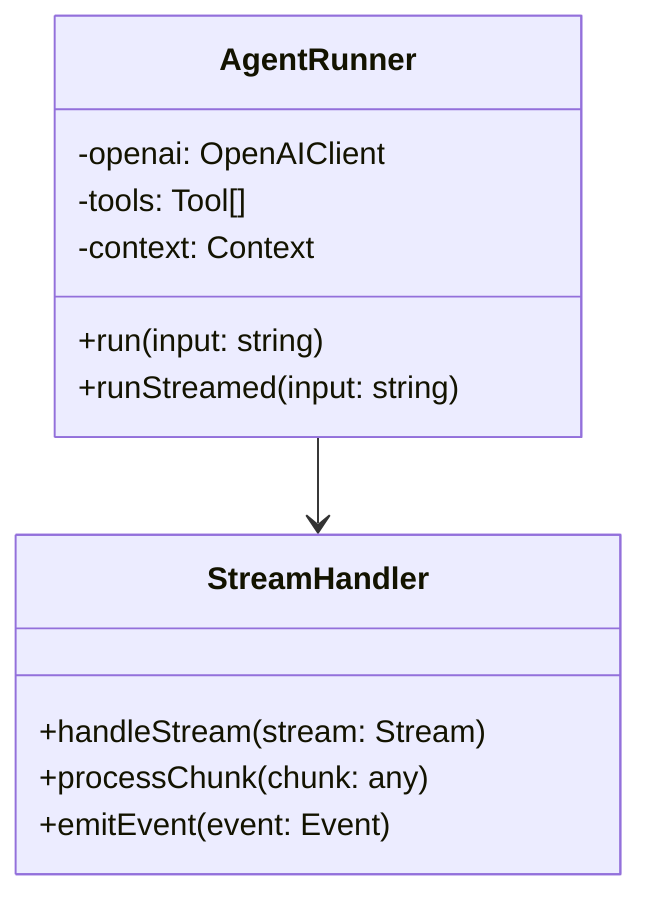

#### Tool System
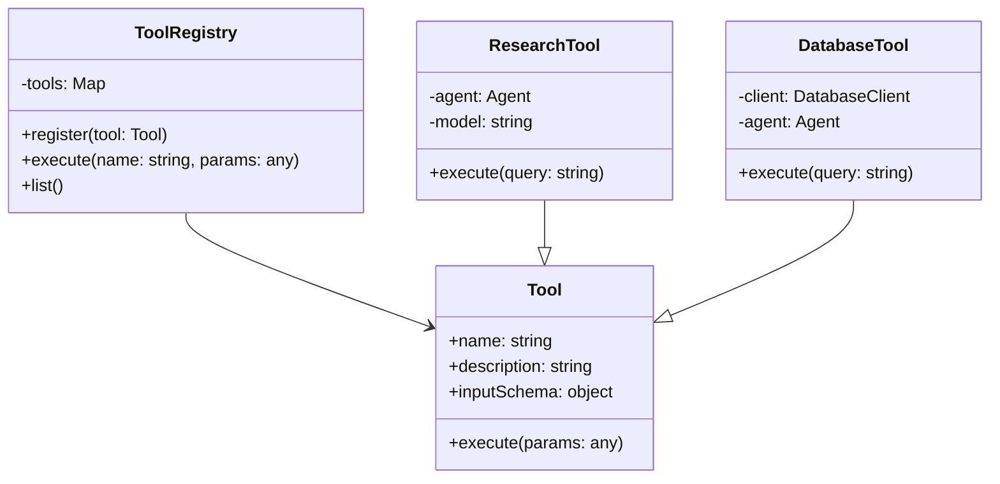

## Data Flow

### 1. Request Processing
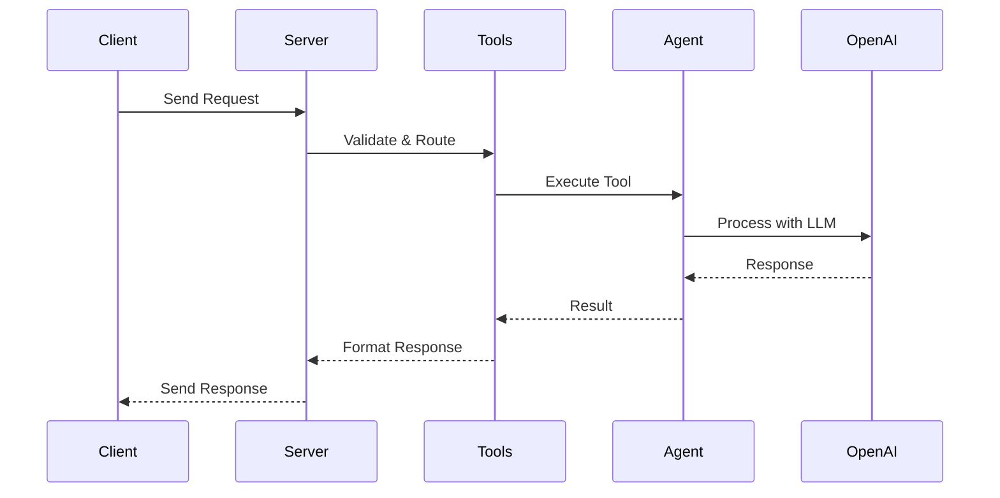

### 2. Streaming Flow
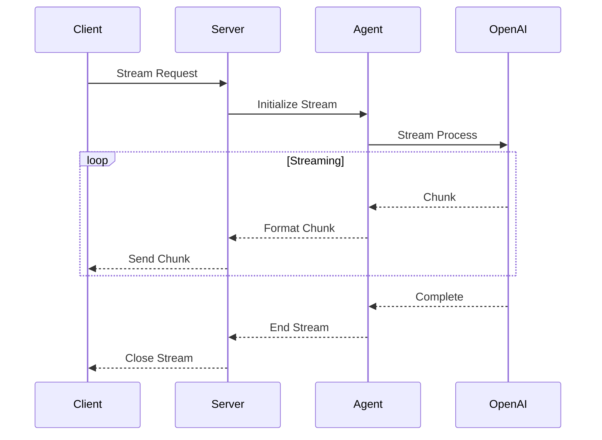

## Security Architecture

### Authentication Flow
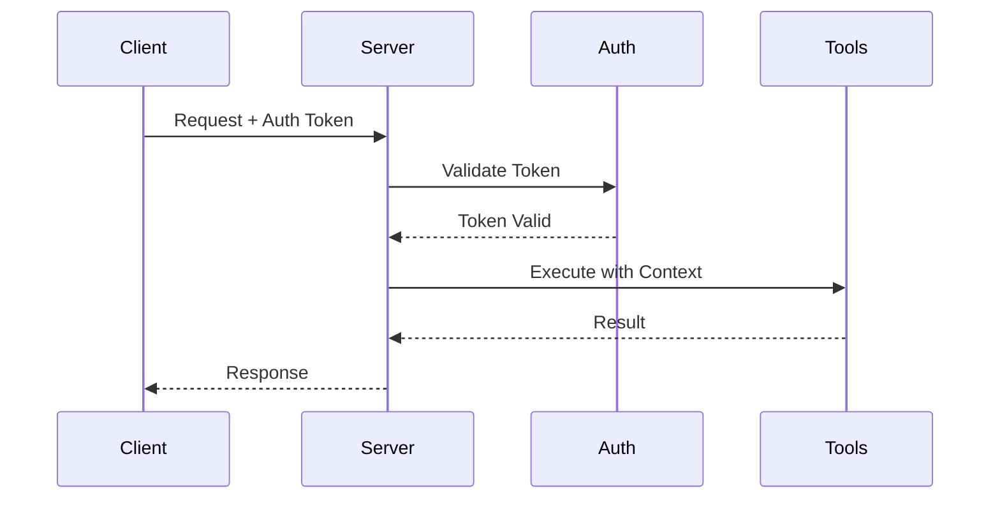

### Authorization Layers
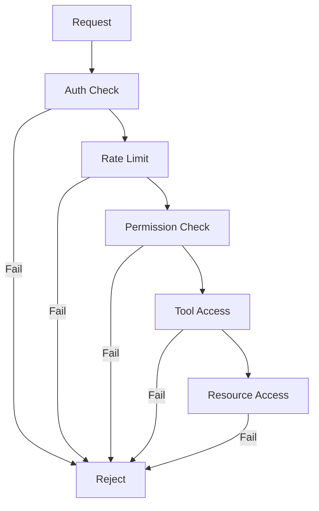

## Deployment Architecture

### Development Setup
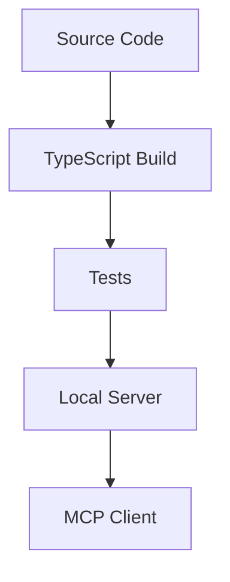

### Production Setup
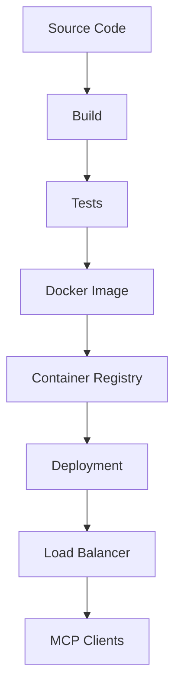

## Error Handling

### Error Flow
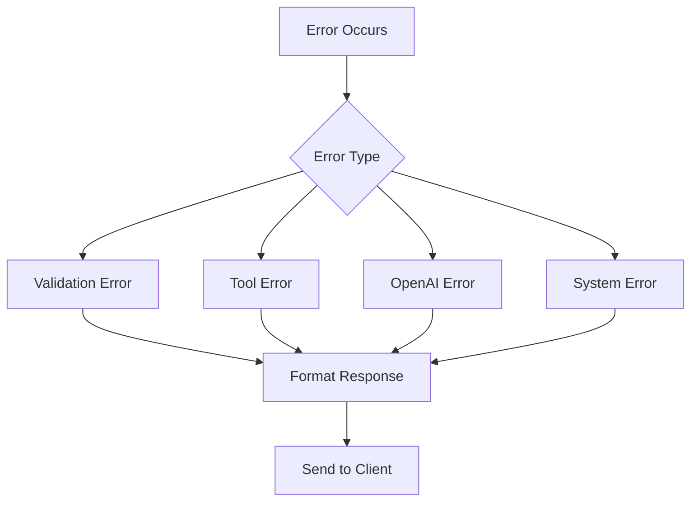

## Monitoring & Logging

### Metrics Flow
```mermaid
graph TD
    A[Server Events] --> B[Metrics Collector]
    B --> C[Time Series DB]
    C --> D[Dashboards]
    
    E[Error Events] --> F[Error Handler]
    F --> G[Error Log]
    G --> H[Alerts]
