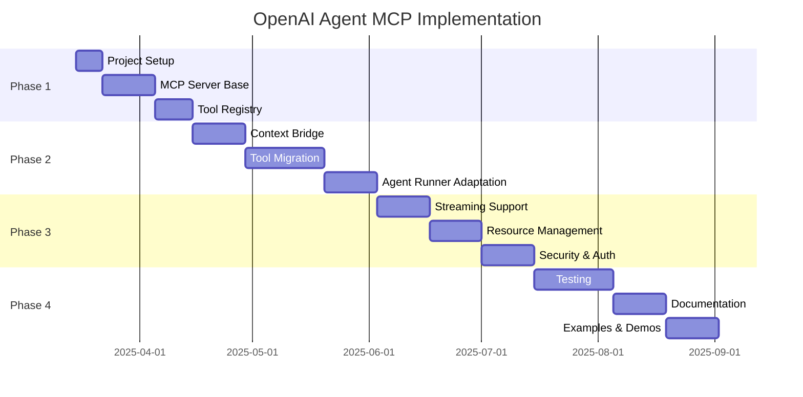

# OpenAI Agent MCP Implementation Phases

## Phase 1: Core Infrastructure

### 1.1 Project Setup
- Initialize TypeScript project structure
- Configure build system
- Set up testing framework
- Create development environment

### 1.2 MCP Server Base
- Implement MCPServer interface
- Create server configuration system
- Set up request/response handling
- Implement basic error handling

### 1.3 Tool Registry
- Create tool registration system
- Implement tool validation
- Set up tool execution pipeline
- Add tool discovery mechanism

## Phase 2: Agent Integration

### 2.1 Context Bridge
- Create MCPContext interface
- Implement context adapter
- Add resource management
- Set up state persistence

### 2.2 Tool Migration
- Convert research agent to MCP tool
- Convert database agent to MCP tool
- Convert support agent to MCP tool
- Implement tool validation

### 2.3 Agent Runner Adaptation
- Modify agent runner for MCP compatibility
- Add streaming support
- Implement progress reporting
- Add error recovery

## Phase 3: Advanced Features

### 3.1 Streaming Support
- Implement streaming adapter
- Add partial response handling
- Create buffering system
- Add reconnection handling

### 3.2 Resource Management
- Implement resource URIs
- Add resource templates
- Create resource caching
- Add resource validation

### 3.3 Security & Authentication
- Add authentication support
- Implement authorization
- Add rate limiting
- Set up logging

## Phase 4: Testing & Documentation

### 4.1 Testing Infrastructure
- Set up unit testing
- Create integration tests
- Add performance tests
- Implement stress testing

### 4.2 Documentation
- Create API documentation
- Write usage examples
- Add configuration guide
- Create troubleshooting guide

### 4.3 Examples & Demos
- Create example applications
- Add demo scripts
- Write tutorials
- Create test cases

## Development Timeline

## Success Criteria

### Functionality
- All agent capabilities exposed as MCP tools
- Streaming responses working correctly
- Resource management functioning
- Error handling robust

### Performance
- Response times under 200ms
- Streaming latency under 50ms
- Resource usage optimized
- Memory leaks eliminated

### Quality
- 90%+ test coverage
- All critical paths tested
- Documentation complete
- Examples working

### Security
- Authentication working
- Authorization enforced
- Rate limiting active
- Logging comprehensive

## Risk Mitigation

### Technical Risks
- OpenAI API changes
- MCP protocol updates
- Performance issues
- Memory leaks

### Mitigation Strategies
- Version pinning
- Protocol abstraction
- Performance monitoring
- Memory profiling

## Monitoring & Maintenance

### Monitoring
- Response times
- Error rates
- Resource usage
- API quotas

### Maintenance
- Weekly updates
- Security patches
- Performance optimization
- Documentation updates
