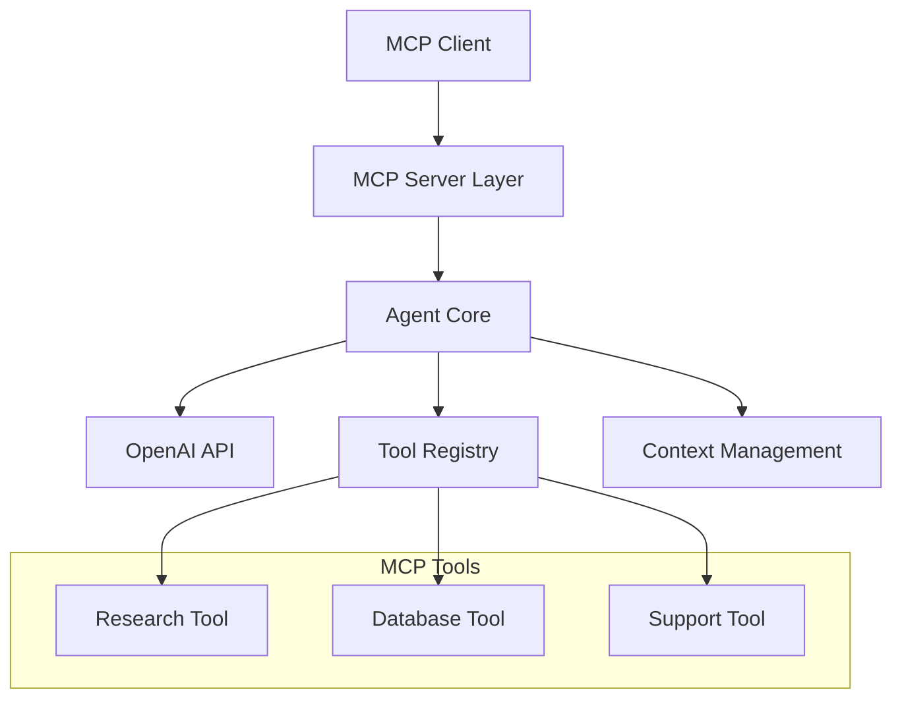

# OpenAI Agent MCP Integration Plan

## Overview
Convert the OpenAI agent into a modular MCP server that exposes agent capabilities through the Model Context Protocol. This will allow the agent to be used as a standard MCP server while maintaining its existing functionality.

## Architecture



## Components

### 1. MCP Server Layer (`src/mcp/server.ts`)
```typescript
interface MCPServer {
  name: string;
  version: string;
  tools: Map<string, MCPTool>;
  registerTool: (tool: MCPTool) => void;
  handleRequest: (request: MCPRequest) => Promise<MCPResponse>;
}

class OpenAIAgentMCPServer implements MCPServer {
  private agentRunner: AgentRunner;
  private toolRegistry: Map<string, MCPTool>;
  
  constructor(config: MCPServerConfig) {
    this.agentRunner = new AgentRunner();
    this.toolRegistry = new Map();
    this.initializeTools();
  }

  private initializeTools() {
    // Convert agent tools to MCP format
    this.registerTool(this.convertResearchTool());
    this.registerTool(this.convertDatabaseTool());
    this.registerTool(this.convertSupportTool());
  }
}
```

### 2. Tool Adapters (`src/mcp/tools/`)

#### Research Tool (`research.ts`)
```typescript
export const researchTool: MCPTool = {
  name: "research",
  description: "Research information using web search",
  inputSchema: {
    type: "object",
    properties: {
      query: {
        type: "string",
        description: "Search query"
      },
      options: {
        type: "object",
        properties: {
          searchDepth: { type: "string" },
          location: { type: "object" }
        }
      }
    },
    required: ["query"]
  },
  execute: async (params, context) => {
    const agent = new Agent({
      model: "gpt-4o-search-preview",
      tools: [webSearchTool]
    });
    return agent.run(params.query);
  }
};
```

#### Database Tool (`database.ts`)
```typescript
export const databaseTool: MCPTool = {
  name: "database_query",
  description: "Query and analyze database data",
  inputSchema: {
    type: "object",
    properties: {
      table: { type: "string" },
      query: { type: "string" },
      filters: { type: "object" }
    },
    required: ["table"]
  },
  execute: async (params, context) => {
    const agent = new Agent({
      model: "gpt-4o-mini",
      tools: [databaseQueryTool]
    });
    return agent.run(params.query);
  }
};
```

### 3. Context Bridge (`src/mcp/context.ts`)
```typescript
interface MCPContext extends Context {
  // MCP-specific additions to Context
  roots: string[];
  reportProgress: (message: string) => void;
  readResource: (uri: string) => Promise<any>;
}

class MCPContextAdapter {
  static adapt(context: Context): MCPContext {
    return {
      ...context,
      roots: [],
      reportProgress: (msg) => context.trackAction(`progress: ${msg}`),
      readResource: async (uri) => context.getResource(uri)
    };
  }
}
```

### 4. Streaming Support (`src/mcp/streaming.ts`)
```typescript
interface MCPStreamHandler {
  handleStream: (stream: AsyncGenerator<StreamEvent>) => AsyncGenerator<MCPStreamResponse>;
}

class OpenAIStreamAdapter implements MCPStreamHandler {
  async *handleStream(stream: AsyncGenerator<StreamEvent>): AsyncGenerator<MCPStreamResponse> {
    for await (const event of stream) {
      yield {
        type: event.type,
        content: event.delta,
        done: event.type === 'final'
      };
    }
  }
}
```

## Implementation Steps

1. Core Infrastructure
   - Create MCP server base implementation
   - Implement tool registration system
   - Set up context bridging

2. Tool Migration
   - Convert research agent to MCP tool
   - Convert database agent to MCP tool
   - Convert support agent to MCP tool
   - Implement tool validation and error handling

3. Streaming Support
   - Implement streaming adapter
   - Add progress reporting
   - Handle partial responses

4. Testing & Integration
   - Unit tests for each component
   - Integration tests for full workflow
   - Performance testing
   - Error handling verification

## File Structure
```
src/
├── mcp/
│   ├── server.ts           # Main MCP server implementation
│   ├── context.ts          # Context bridging
│   ├── streaming.ts        # Streaming support
│   └── tools/
│       ├── research.ts     # Research tool implementation
│       ├── database.ts     # Database tool implementation
│       └── support.ts      # Support tool implementation
├── agent/
│   ├── runner.ts           # Existing agent runner
│   ├── context.ts          # Existing context management
│   └── tools.ts           # Existing tool definitions
└── index.ts               # Main entry point
```

## Configuration
```typescript
interface MCPServerConfig {
  name: string;
  version: string;
  openai: {
    apiKey: string;
    defaultModel: string;
  };
  tools: {
    enabled: string[];
    config: Record<string, any>;
  };
  streaming: {
    enabled: boolean;
    bufferSize: number;
  };
}
```

## Usage Example
```typescript
import { OpenAIAgentMCPServer } from './src/mcp/server';

const server = new OpenAIAgentMCPServer({
  name: 'openai-agent',
  version: '1.0.0',
  openai: {
    apiKey: process.env.OPENAI_API_KEY,
    defaultModel: 'gpt-4o-mini'
  },
  tools: {
    enabled: ['research', 'database', 'support'],
    config: {
      database: {
        supabaseUrl: process.env.SUPABASE_URL,
        supabaseKey: process.env.SUPABASE_KEY
      }
    }
  },
  streaming: {
    enabled: true,
    bufferSize: 1024
  }
});

server.serve();
```

## Next Steps

1. Initial Setup
   - Create project structure
   - Set up TypeScript configuration
   - Install dependencies

2. Core Implementation
   - Implement MCP server base
   - Create tool registration system
   - Set up context bridging

3. Tool Migration
   - Convert existing tools to MCP format
   - Implement tool validation
   - Add error handling

4. Testing
   - Write unit tests
   - Create integration tests
   - Perform load testing

5. Documentation
   - API documentation
   - Usage examples
   - Configuration guide
