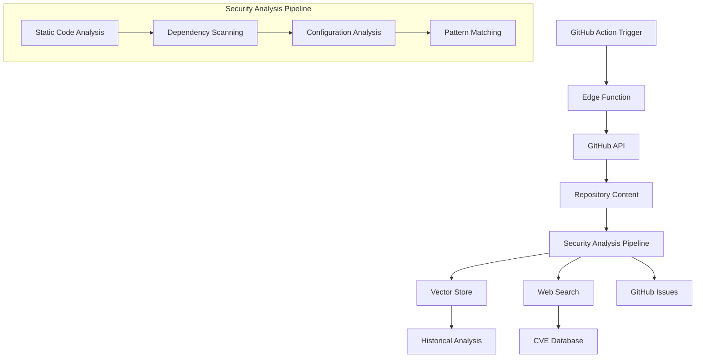

# Security Scanner Edge Function Plan

## Overview

The Security Scanner Edge Function (repo-security-scan) will provide automated security analysis for code repositories. By leveraging vector search capabilities and OpenAI's web search functionality, it will identify potential security vulnerabilities, track findings over time, and create GitHub issues for critical problems.

## Architecture



## Key Components

### 1. Vector Store Integration

The function will create and manage repository-specific vector stores for security scans:

- Create a dedicated vector store for each repository
- Store code snippets with security context
- Maintain a catalog of known vulnerability patterns
- Track historical scan results for trend analysis

Implementation approach:
```typescript
// Create a vector store for a repository
async function createRepoVectorStore(repoName: string): Promise<string> {
  const vectorStore = await openai.vectorStores.create({
    name: `security-scan-${repoName}`,
    expires_after: {
      anchor: "last_active_at",
      days: 90 // Keep security data for 90 days
    }
  });
  
  return vectorStore.id;
}

// Add security findings to vector store
async function storeSecurityFindings(
  vectorStoreId: string, 
  findings: SecurityFinding[]
): Promise<void> {
  // Convert findings to text for vectorization
  for (const finding of findings) {
    const findingText = `
      Severity: ${finding.severity}
      Category: ${finding.category}
      File: ${finding.file}
      Line: ${finding.line_number || 'N/A'}
      Description: ${finding.description}
      Recommendation: ${finding.recommendation}
      CVE IDs: ${finding.cve_ids?.join(', ') || 'None'}
      Score: ${finding.score}
      Timestamp: ${new Date().toISOString()}
    `;
    
    // Create a file with the finding
    const file = new File(
      [findingText],
      `finding-${Date.now()}.txt`,
      { type: 'text/plain' }
    );

    // Upload to OpenAI
    const uploadedFile = await openai.files.create({
      file,
      purpose: "assistants"
    });

    // Add to vector store
    await openai.vectorStores.files.create(vectorStoreId, {
      file_id: uploadedFile.id
    });
  }
}
```

### 2. Security Analysis Pipeline

The function will implement a comprehensive security analysis pipeline:

- **Static Code Scanning**: Analyze code for hardcoded secrets, insecure patterns
- **Dependency Scanning**: Check for known vulnerabilities in dependencies
- **Configuration Analysis**: Validate security settings in config files
- **Pattern Matching**: Use vector similarity to find known vulnerability patterns

Implementation approach:
```typescript
// Main security scanning function
async function scanRepository(
  repoName: string, 
  branch: string = "main"
): Promise<ScanResult> {
  // Initialize scan result
  const scanId = crypto.randomUUID();
  const scanResult: ScanResult = {
    repo_name: repoName,
    scan_id: scanId,
    timestamp: new Date().toISOString(),
    findings: [],
    statistics: {
      files_scanned: 0,
      issues_by_severity: {
        critical: 0,
        high: 0,
        medium: 0,
        low: 0
      },
      trends: {}
    }
  };

  // Fetch repository content
  const repoContent = await fetchRepositoryContent(repoName, branch);
  scanResult.statistics.files_scanned = repoContent.length;

  // Run security checks
  const secretsFindings = await scanForSecrets(repoContent);
  const dependencyFindings = await scanDependencies(repoContent);
  const configFindings = await analyzeConfigurations(repoContent);
  const patternFindings = await detectVulnerabilityPatterns(repoContent);

  // Combine all findings
  scanResult.findings = [
    ...secretsFindings,
    ...dependencyFindings,
    ...configFindings,
    ...patternFindings
  ];

  // Update statistics
  scanResult.findings.forEach(finding => {
    scanResult.statistics.issues_by_severity[finding.severity]++;
  });

  // Store scan results in vector store
  const vectorStoreId = await getOrCreateVectorStore(repoName);
  await storeSecurityFindings(vectorStoreId, scanResult.findings);

  // Create GitHub issues for critical and high severity findings
  await createGitHubIssues(repoName, scanResult.findings.filter(
    f => f.severity === 'critical' || f.severity === 'high'
  ));

  return scanResult;
}
```

### 3. Web Search Enhancement

The function will use OpenAI's web search capabilities to enhance security analysis:

- Fetch latest CVEs related to repository dependencies
- Get real-time security advisories
- Update vulnerability database nightly

Implementation approach:
```typescript
// Search for latest CVEs for a dependency
async function searchLatestCVEs(
  packageName: string, 
  version: string
): Promise<string[]> {
  const webResponse = await openai.chat.completions.create({
    model: "gpt-4o-search-preview",
    messages: [{
      role: "user",
      content: `Find the latest CVEs and security advisories for the following package: ${packageName}@${version}. Return only the CVE IDs in a JSON array format.`
    }],
    web_search_options: {
      search_context_size: "high"
    }
  });

  try {
    // Extract CVE IDs from response
    const content = webResponse.choices[0]?.message?.content || "[]";
    const cveIds = JSON.parse(content);
    return Array.isArray(cveIds) ? cveIds : [];
  } catch (error) {
    console.error("Error parsing CVE response:", error);
    return [];
  }
}

// Enhance dependency findings with web search
async function enhanceDependencyFindings(
  findings: SecurityFinding[]
): Promise<SecurityFinding[]> {
  const enhancedFindings = [...findings];
  
  for (const finding of enhancedFindings) {
    if (finding.category === 'dependency') {
      // Extract package name and version from description
      const match = finding.description.match(/([a-zA-Z0-9\-_\.]+)@([0-9\.]+)/);
      if (match) {
        const [, packageName, version] = match;
        const cveIds = await searchLatestCVEs(packageName, version);
        
        if (cveIds.length > 0) {
          finding.cve_ids = cveIds;
          finding.description += `\n\nLatest CVEs: ${cveIds.join(', ')}`;
          
          // Increase severity if critical CVEs found
          if (cveIds.some(cve => cve.includes('CRITICAL'))) {
            finding.severity = 'critical';
            finding.score = Math.max(finding.score, 9.0);
          }
        }
      }
    }
  }
  
  return enhancedFindings;
}
```

### 4. GitHub Actions Integration

The function will integrate with GitHub Actions for automated scanning:

- Nightly scans triggered by GitHub Actions
- On-demand scans via manual trigger
- Scan results stored in vector database
- GitHub issues created for high-priority findings

Implementation approach:
```yaml
# .github/workflows/security-scan.yml
name: Nightly Security Scan
on:
  schedule:
    - cron: '0 2 * * *'  # Run at 2 AM daily
  workflow_dispatch:     # Manual trigger option

jobs:
  security-scan:
    runs-on: ubuntu-latest
    steps:
      - name: Trigger Security Scan
        run: |
          curl -X POST https://${{ secrets.SUPABASE_PROJECT_REF }}.functions.supabase.co/repo-security-scan/cron-trigger \
          -H "Authorization: Bearer ${{ secrets.SUPABASE_ANON_KEY }}" \
          -H "Content-Type: application/json" \
          --data '{"repo": "${{ github.repository }}", "branch": "main"}'
```

## API Endpoints

The function will expose the following endpoints:

1. `/init-scan`: Initialize a vector store for a repository
   ```typescript
   // POST /init-scan
   // Body: { "repo": "owner/repo" }
   // Returns: { "vectorStoreId": "vs_..." }
   ```

2. `/scan-repo`: Run a full security scan
   ```typescript
   // POST /scan-repo
   // Body: { "repo": "owner/repo", "branch": "main" }
   // Returns: ScanResult object
   ```

3. `/scan-results`: Get historical scan results
   ```typescript
   // POST /scan-results
   // Body: { "repo": "owner/repo", "limit": 10 }
   // Returns: { "results": ScanResult[] }
   ```

4. `/create-issues`: Create GitHub issues for findings
   ```typescript
   // POST /create-issues
   // Body: { "repo": "owner/repo", "findings": SecurityFinding[] }
   // Returns: { "created": number, "issues": string[] }
   ```

5. `/cron-trigger`: Endpoint for GitHub Actions to trigger nightly scans
   ```typescript
   // POST /cron-trigger
   // Body: { "repo": "owner/repo", "branch": "main" }
   // Returns: { "scanId": "scan_..." }
   ```

6. `/send-report`: Send a security report via email
   ```typescript
   // POST /send-report
   // Body: { "repo": "owner/repo", "recipient": "user@example.com", "includeRecommendations": true }
   // Returns: { "success": true, "message": "Report sent successfully" }
   ```

## Implementation Details

### Type Definitions

```typescript
// Type definitions for security findings
interface SecurityFinding {
  severity: 'critical' | 'high' | 'medium' | 'low';
  category: 'credentials' | 'dependency' | 'code_pattern' | 'configuration';
  file: string;
  line_number?: number;
  description: string;
  recommendation: string;
  cve_ids?: string[];
  score: number;
}

interface ScanResult {
  repo_name: string;
  scan_id: string;
  timestamp: string;
  findings: SecurityFinding[];
  statistics: {
    files_scanned: number;
    issues_by_severity: Record<string, number>;
    trends: any;
  }
}
```

### Main Function

```typescript
// Main serve function
serve(async (req) => {
  // CORS handling
  if (req.method === "OPTIONS") {
    return new Response("ok", { headers: corsHeaders });
  }

  try {
    const url = new URL(req.url);
    const path = url.pathname.split("/").pop();

    if (!path) {
      throw new Error("Path is required");
    }

    // Route handling
    switch (path) {
      case "init-scan": {
        // Initialize scan for a repository
        const { repo } = await req.json();
        const vectorStoreId = await createRepoVectorStore(repo);
        return new Response(JSON.stringify({ vectorStoreId }), {
          headers: { ...corsHeaders, "Content-Type": "application/json" },
        });
      }

      case "scan-repo": {
        // Run a full security scan
        const { repo, branch = "main" } = await req.json();
        const scanResult = await scanRepository(repo, branch);
        return new Response(JSON.stringify(scanResult), {
          headers: { ...corsHeaders, "Content-Type": "application/json" },
        });
      }

      case "scan-results": {
        // Get historical scan results
        const { repo, limit = 10 } = await req.json();
        const results = await getHistoricalScans(repo, limit);
        return new Response(JSON.stringify({ results }), {
          headers: { ...corsHeaders, "Content-Type": "application/json" },
        });
      }

      case "create-issues": {
        // Create GitHub issues for findings
        const { repo, findings } = await req.json();
        const issueResults = await createGitHubIssues(repo, findings);
        return new Response(JSON.stringify(issueResults), {
          headers: { ...corsHeaders, "Content-Type": "application/json" },
        });
      }

      case "cron-trigger": {
        // Endpoint for GitHub Actions to trigger scans
        const { repo, branch = "main" } = await req.json();
        const scanId = crypto.randomUUID();
        // Queue the scan to run asynchronously
        scanRepository(repo, branch).catch(console.error);
        return new Response(JSON.stringify({ scanId }), {
          headers: { ...corsHeaders, "Content-Type": "application/json" },
        });
      }

      default:
        throw new Error(`Unknown path: ${path}`);
    }
  } catch (error: unknown) {
    const errorMessage = error instanceof Error ? error.message : "An unknown error occurred";
    return new Response(JSON.stringify({ error: errorMessage }), {
      status: 400,
      headers: { ...corsHeaders, "Content-Type": "application/json" },
    });
  }
});
```

## Security Considerations

1. **Authentication**: All endpoints require proper authentication via Supabase JWT
2. **Rate Limiting**: Implement rate limiting to prevent abuse
3. **Secure Storage**: Sensitive findings are stored securely in the vector database
4. **Access Control**: Only repository owners/admins can access scan results
5. **Data Retention**: Security findings expire after 90 days by default

## Email Notifications and Reports

The function will integrate with the Resend email service to provide daily status updates and security reports:

- **Daily Status Updates**: Automated emails with a summary of security findings
- **Issue Reviews**: Detailed analysis of security issues with severity ratings
- **Remediation Suggestions**: Recommendations for fixing identified vulnerabilities
- **Historical Trends**: Comparison with previous scans to track security posture over time

Implementation approach:
```typescript
// Send a security report via email
async function sendSecurityReport(
  repoName: string,
  recipient: string,
  includeRecommendations: boolean = true
): Promise<boolean> {
  try {
    // Get the latest scan results
    const scanResults = await getHistoricalScans(repoName, 1);
    if (scanResults.length === 0) {
      console.error("No scan results found for repository:", repoName);
      return false;
    }
    
    const latestScan = scanResults[0];
    
    // Generate HTML content for the email
    const htmlContent = generateReportHtml(latestScan, includeRecommendations);
    
    // Send the email using the resend function
    const response = await fetch(`${Deno.env.get("SUPABASE_URL")}/functions/v1/resend`, {
      method: 'POST',
      headers: {
        'Content-Type': 'application/json',
        'Authorization': `Bearer ${Deno.env.get("SUPABASE_ANON_KEY")}`
      },
      body: JSON.stringify({
        agentName: "Security Scanner",
        message: htmlContent,
        recipient: recipient,
        action: "notify"
      })
    });
    
    if (!response.ok) {
      throw new Error(`Failed to send email: ${response.statusText}`);
    }
    
    return true;
  } catch (error) {
    console.error("Error sending security report:", error);
    return false;
  }
}

// Generate HTML content for the security report
function generateReportHtml(
  scanResult: ScanResult,
  includeRecommendations: boolean
): string {
  // Count issues by severity
  const criticalCount = scanResult.statistics.issues_by_severity.critical || 0;
  const highCount = scanResult.statistics.issues_by_severity.high || 0;
  const mediumCount = scanResult.statistics.issues_by_severity.medium || 0;
  const lowCount = scanResult.statistics.issues_by_severity.low || 0;
  
  // Generate HTML for the report
  let html = `
    <div style="font-family: Arial, sans-serif; max-width: 800px; margin: 0 auto;">
      <h1 style="color: #333;">Security Scan Report: ${scanResult.repo_name}</h1>
      <p style="color: #666;">Scan completed on: ${new Date(scanResult.timestamp).toLocaleString()}</p>
      
      <div style="background-color: #f5f5f5; padding: 15px; border-radius: 5px; margin: 20px 0;">
        <h2 style="margin-top: 0;">Summary</h2>
        <p>Files scanned: <strong>${scanResult.statistics.files_scanned}</strong></p>
        <p>Issues found: <strong>${scanResult.findings.length}</strong></p>
        <ul>
          <li style="color: ${criticalCount > 0 ? '#d32f2f' : '#666'};">Critical: <strong>${criticalCount}</strong></li>
          <li style="color: ${highCount > 0 ? '#f57c00' : '#666'};">High: <strong>${highCount}</strong></li>
          <li style="color: ${mediumCount > 0 ? '#fbc02d' : '#666'};">Medium: <strong>${mediumCount}</strong></li>
          <li style="color: ${lowCount > 0 ? '#7cb342' : '#666'};">Low: <strong>${lowCount}</strong></li>
        </ul>
      </div>
  `;
  
  // Add critical and high findings
  const criticalAndHighFindings = scanResult.findings.filter(
    f => f.severity === 'critical' || f.severity === 'high'
  );
  
  if (criticalAndHighFindings.length > 0) {
    html += `
      <h2 style="color: #d32f2f;">Critical & High Priority Issues</h2>
      <table style="width: 100%; border-collapse: collapse;">
        <tr style="background-color: #f5f5f5;">
          <th style="text-align: left; padding: 8px; border: 1px solid #ddd;">Severity</th>
          <th style="text-align: left; padding: 8px; border: 1px solid #ddd;">Category</th>
          <th style="text-align: left; padding: 8px; border: 1px solid #ddd;">File</th>
          <th style="text-align: left; padding: 8px; border: 1px solid #ddd;">Description</th>
        </tr>
    `;
    
    for (const finding of criticalAndHighFindings) {
      const severityColor = finding.severity === 'critical' ? '#d32f2f' : '#f57c00';
      
      html += `
        <tr>
          <td style="padding: 8px; border: 1px solid #ddd; color: ${severityColor}; font-weight: bold;">${finding.severity.toUpperCase()}</td>
          <td style="padding: 8px; border: 1px solid #ddd;">${finding.category}</td>
          <td style="padding: 8px; border: 1px solid #ddd;">${finding.file}${finding.line_number ? `:${finding.line_number}` : ''}</td>
          <td style="padding: 8px; border: 1px solid #ddd;">${finding.description}</td>
        </tr>
      `;
      
      if (includeRecommendations) {
        html += `
          <tr>
            <td colspan="4" style="padding: 8px; border: 1px solid #ddd; background-color: #f9f9f9;">
              <strong>Recommendation:</strong> ${finding.recommendation}
            </td>
          </tr>
        `;
      }
    }
    
    html += `</table>`;
  }
  
  // Add footer
  html += `
      <div style="margin-top: 30px; padding-top: 20px; border-top: 1px solid #eee; color: #999;">
        <p>This is an automated security report generated by the Security Scanner.</p>
        <p>Scan ID: ${scanResult.scan_id}</p>
      </div>
    </div>
  `;
  
  return html;
}
```

## Implementation Considerations and Improvements

### Error Handling
- Implement robust error handling for all external API calls
- Add specific handling for network issues, API rate limiting, and service outages
- Create a centralized error logging system for better debugging
- Implement retry mechanisms for transient failures

### Security
- Add validation checks for all required API keys before using them
- Implement secure storage for scan results with proper access controls
- Add authentication and authorization for all API endpoints
- Sanitize all user inputs to prevent injection attacks

### Scalability
- Implement pagination for repository content fetching to handle large repositories
- Add support for incremental scanning to reduce resource usage
- Implement caching mechanisms for frequently accessed data
- Use worker pools for parallel processing of large codebases

### Dependency Management
- Integrate with vulnerability databases like NVD or OSV
- Implement proper version comparison logic for dependency checking
- Support multiple package ecosystems (npm, pip, gem, etc.)
- Add periodic updates of vulnerability data

### Performance Optimization
- Implement rate limiting for external API calls
- Use parallel processing for independent operations
- Optimize vector store operations for large datasets
- Implement request batching for GitHub API calls

### Code Quality
- Abstract common functionality into helper functions
- Implement consistent error handling patterns
- Add comprehensive input validation
- Use TypeScript interfaces for better type safety

### Testing and Documentation
- Add unit tests for all core functions
- Implement integration tests for end-to-end workflows
- Create comprehensive API documentation
- Add code examples for common use cases

### Configuration
- Move hardcoded values to a configuration file
- Support environment-specific configurations
- Implement feature flags for experimental features
- Add runtime configuration validation

## Future Enhancements

1. **Custom Rules**: Allow users to define custom security rules
2. **Integration with CI/CD**: Integrate with more CI/CD platforms beyond GitHub Actions
3. **Vulnerability Scoring**: Implement CVSS scoring for more accurate severity assessment
4. **Remediation Automation**: Suggest automated fixes for common issues
5. **Dashboard**: Create a visual dashboard for security posture monitoring
6. **Scheduled Reports**: Configure frequency and recipients for automated security reports
7. **Machine Learning**: Use ML to improve vulnerability detection accuracy
8. **Historical Trend Analysis**: Track security posture over time
9. **Custom Policies**: Allow organizations to define security policies
10. **Integration with SIEM**: Send security findings to SIEM systems

## Implementation Timeline

1. **Phase 1**: Core scanning functionality and vector store integration
   - Basic repository scanning
   - Vector store setup and integration
   - Initial security checks implementation

2. **Phase 2**: Web search enhancement and CVE integration
   - OpenAI web search integration
   - CVE database integration
   - Enhanced dependency scanning

3. **Phase 3**: GitHub Actions integration and issue creation
   - GitHub API integration
   - Automated issue creation
   - CI/CD workflow setup

4. **Phase 4**: Robustness and scalability improvements
   - Error handling enhancements
   - Rate limiting implementation
   - Performance optimizations
   - Large repository support

5. **Phase 5**: Testing and documentation
   - Unit and integration tests
   - API documentation
   - Usage examples
   - Deployment guides

6. **Phase 6**: Historical analysis and reporting
   - Trend analysis
   - Email reporting
   - Scheduled scans
   - Custom report templates

7. **Phase 7**: UI dashboard and advanced features
   - Web dashboard
   - Advanced visualization
   - User management
   - Custom rules engine
